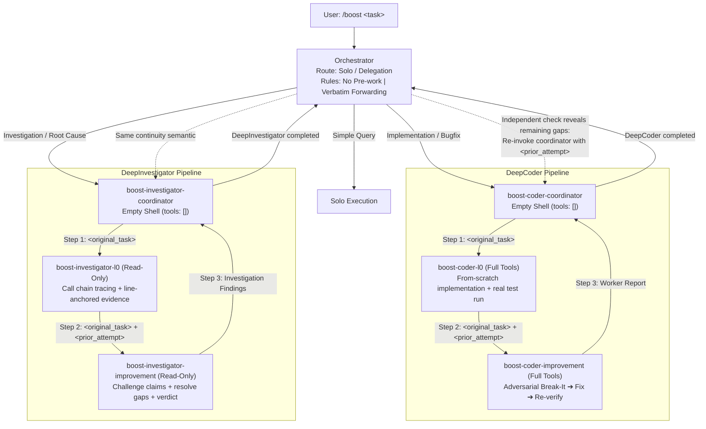

# open-boost

> Universal adversarial deep-reasoning multi-agent plugin for coding harnesses (Pi, OpenCode, OMP).
>
> Optimized for high-throughput Flash models (`gemini-3.8-flash`, `deepseek-v4.1-flash`, `qwen-2.5-coder-32b`).

[English](./README.md) | [简体中文](./README_CN.md)

[](https://opensource.org/licenses/Apache-2.0)
[](https://nodejs.org/)
[](https://www.npmjs.com/package/open-boost)
[]()

---

## Overview

### Core Thesis
**Deep reasoning emerges from adversarial protocols and strict cognitive contracts, not parameter scale.**

`open-boost` provides a clean implementation of the `/boost` multi-agent pipeline for open-source terminal coding harnesses:

- **Pi Coding Agent** (`pi`)
- **OpenCode** (`opencode`)
- **Oh My Pi** (`omp`)

Through physical tool isolation, two-stage adversarial execution (**L0 Worker** ➔ **Improvement Worker Break-It**), and skepticism verification protocols, `open-boost` enables Flash-tier models to solve complex race conditions, multi-file refactors, and root-cause investigations.



---

## Installation

Requires Node.js `>= 18.0.0`. Cross-platform (Linux, macOS, Windows). Zero native compilation dependencies.

### Option 1: Via npm / npx (Recommended)

```bash
# Run installer directly without cloning
npx open-boost install

# Or install globally
npm install -g open-boost
open-boost install
```

### Option 2: From Source

```bash
git clone https://github.com/YunhaoFu/open-boost.git
cd open-boost

# Check detected harnesses
node install.js status

# Install into all detected harnesses
node install.js install
```

### Selective Target Installation

```bash
# Target specific harness
open-boost install --target pi
open-boost install --target opencode
open-boost install --target omp
open-boost install --target pi,omp
```

---

## Usage

Invoke `/boost` inside your preferred CLI harness:

### Pi Coding Agent
```bash
pi
> /boost Fix the connection pool deadlock under high concurrency without leaking sockets.
```
Or in non-interactive mode:
```bash
pi -p "/boost Fix the connection pool deadlock under high concurrency"
```

### OpenCode
```bash
opencode
> /boost Trace why request timeouts spike when payload exceeds 2MB, read-only.
```
Or via registered command:
```bash
opencode run "/boost Trace memory leak in batch runner"
```

### Oh My Pi (OMP)
```bash
omp
> /boost Fix floating point cumulative error in sliding window calculation, pytest must pass.
```

---

## Architecture & Invariants

The implementation enforces 7 behavioral invariants:

1. **Declarative Routing**: The orchestrator must state `Solo` or `Delegation` routine before action.
2. **No Pre-work**: The orchestrator must not inspect files, search, or edit prior to initial delegation.
3. **Verbatim Forwarding**: The `<original_task>` sent to coordinators must match user input word-for-word.
4. **Continuity**: Continuation rounds must re-invoke the same coordinator with `<prior_attempt>`, preserving context.
5. **Aggressive Continuation**: Any unverified edge case, ambiguous requirement, or reported limitation mandates a follow-up round.
6. **Skepticism Protocol**:
   - Mandatory `Skepticism Disclaimer` header.
   - Three-tier verification: `Deep` (requires executed command + raw output), `Shallow` (visual inspection only), `Unverified` (known gaps).
   - Structured known issues (`Fatal Functional Bug`, `Shallow Verification`, `Minor Robustness Risk`).
   - Improvement worker requires concrete failure repro: `input → expected → actual → root cause → fix`.
7. **Single Atomic Delivery**: Subagents emit no intermediate conversation deltas; execution yields exactly once upon completion.

---

## Flash Model Defenses

Designed to prevent failure modes common in lightweight/flash models:

- **Anti-Sycophancy (Pre-commitment)**: Improvement workers must state independent requirements understanding before reading prior reports, and must find at least one failing case before accepting.
- **Anti-Shallow-Verification**: Requires concrete test command logs; validates test file integrity via git diff/stat to prevent test weakening.
- **Anti-Drift**: Coordinators have empty toolsets (`tools: []`), preventing them from performing code modifications directly.
- **Auto-Healing Output Parser**: Strips unintended JSON envelopes or redundant markdown fences from upstream gateway translations.

---

## Repository Structure

```
open-boost/
├── install.js                     # Root direct launcher (npx / node install.js)
├── package.json                   # NPM package definition & CLI entry
├── packages/
│   ├── core/                      # SSOT prompts and schemas
│   │   ├── prompts/               # 7 core prompt definitions
│   │   │   ├── orchestrator.md
│   │   │   ├── boost-coder-coordinator.md
│   │   │   ├── boost-coder-l0.md
│   │   │   ├── boost-coder-improvement.md
│   │   │   ├── boost-investigator-coordinator.md
│   │   │   ├── boost-investigator-l0.md
│   │   │   └── boost-investigator-improvement.md
│   │   └── specs/                 # Output schemas
│   ├── compiler/                  # Transpiler for target harness formats
│   │   └── src/index.js           # Generates dist/ from SSOT
│   ├── adapters/                  # Harness configuration hooks
│   │   ├── omp/index.js           # OMP config patch & file copy
│   │   ├── pi/index.js            # Pi extension & slash command registration
│   │   └── opencode/index.js      # OpenCode JSONC patch & agent registration
│   └── cli/                       # Detection and installation engine
│       ├── bin/open-boost.js
│       └── src/installer.js
├── dist/                          # Ready-to-install distributions
│   ├── omp/
│   ├── pi/
│   └── opencode/
└── test/
    └── open-boost.test.js         # Node.js native test suite
```

---

## Development & Testing

```bash
# Run test suite
npm test

# Check harness installation status
npm run status

# Recompile distribution artifacts from SSOT prompts
npm run build
```

---

## License

Apache-2.0. See [LICENSE](./LICENSE) for details.
