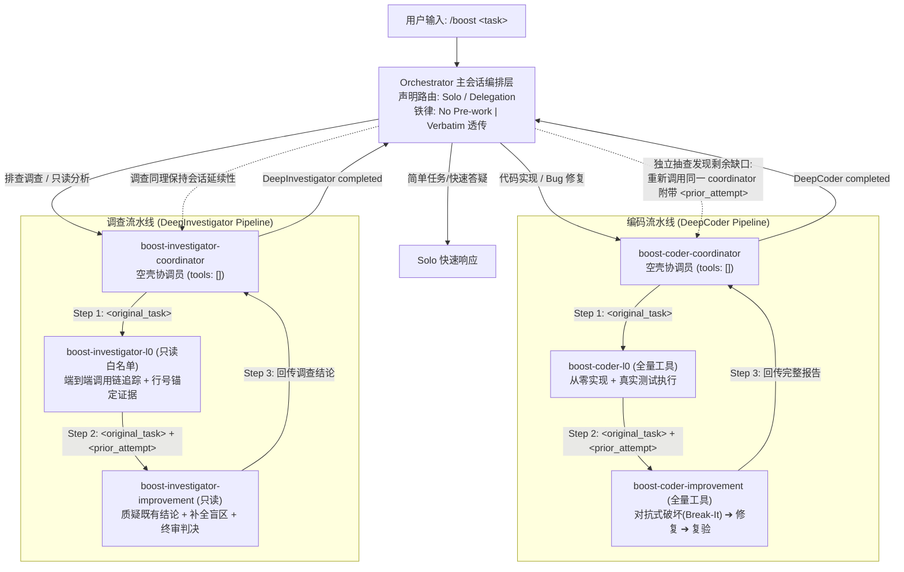

# open-boost

> 面向主流开源终端 Coding Harness（Pi、OpenCode、OMP）的通用对抗式深度推理多 Agent 插件。
>
> 专为高性价比 Flash 系列模型（`gemini-3.8-flash`、`deepseek-v4.1-flash`、`qwen-2.5-coder-32b`）深度优化。

[简体中文](./README.md) | [English](./README_EN.md)

[](https://opensource.org/licenses/Apache-2.0)
[](https://nodejs.org/)
[](https://www.npmjs.com/package/open-boost)
[]()

---

## 项目概述

### 核心命题
**深度推理源于对抗式交互协议与严格的认知契约，而非单纯堆砌模型参数。**

`open-boost` 将源自 Google Antigravity 的 `/boost` 深度推理机制进行开源实现与生态适配，首期完整支持三大主流开源终端 Coding Harness：

- **Pi Coding Agent** (`pi`)
- **OpenCode** (`opencode`)
- **Oh My Pi** (`omp`)

通过物理级工具隔离、双阶段对抗式执行（**L0 Worker 从零实现** ➔ **Improvement Worker 破坏性验证**）以及怀疑论报告契约，`open-boost` 使得极低成本的 Flash 梯队模型能够稳健解决并发竞态条件、复杂跨文件重构以及深层代码根因排查等高难度任务。



---

## 安装指引

运行环境要求：Node.js `>= 18.0.0`。全平台支持（Linux、macOS、Windows），零原生编译依赖（Zero Native Dependencies）。

### 方式一：通过 npm / npx（推荐，无需克隆代码）

```bash
# 直接免安装执行安装器
npx open-boost install

# 或作为全局 CLI 工具安装
npm install -g open-boost
open-boost status
open-boost install
```

### 方式二：源码安装

```bash
git clone https://github.com/YunhaoFu/open-boost.git
cd open-boost

# 检查当前环境检测到的 harness 状态
node install.js status

# 一键安装至所有检测到的 harness
node install.js install
```

### 定向安装到指定 Harness

```bash
# 仅安装至指定目标
open-boost install --target pi
open-boost install --target opencode
open-boost install --target omp
open-boost install --target pi,omp
```

---

## 使用说明

在您习惯的终端 Coding Harness 中直接输入 `/boost`：

### 1. Pi Coding Agent (`pi`)
```bash
pi
> /boost 修复 connection_pool.py 中的高并发死锁问题，确保无连接泄漏
```
或非交互单轮模式：
```bash
pi -p "/boost 修复 connection_pool.py 中的高并发死锁问题"
```

### 2. OpenCode (`opencode`)
```bash
opencode
> /boost 深入排查请求负载超过 2MB 时超时激增的原因，保持只读不改代码
```
或通过注册命令执行：
```bash
opencode run "/boost 调查批处理任务中的内存泄漏点"
```

### 3. Oh My Pi (`omp`)
```bash
omp
> /boost 修复 moving_avg.py 滑窗浮点累积误差 bug，pytest 必须全绿，严禁修改测试
```

---

## 架构与核心守恒量 (Invariants)

系统在跨平台与不同模型下严格恪守 7 项行为守恒量：

1. **声明式路由 (Declarative Routing)**：编排者在采取任何行动前，必须在控制台显式声明 `Solo` 或 `Delegation` 模式。
2. **No Pre-work 铁律**：主会话编排层在首次委派前，禁止私自检索代码库或读取编辑文件，职责严格限定为“只路由、不解题”。
3. **高保真原样传话 (Verbatim Forwarding)**：发送给协调员的 `<original_task>` 必须与用户原始输入逐字一致。
4. **会话延续不另起 (Continuity)**：编排层抽查若发现缺口追加下一轮，必须向同一个 Coordinator 发起，并完整携带上一轮报告。
5. **宁多勿少 (Aggressive Continuation)**：凡存在未覆盖要求、模糊范围、潜在 Bug 或 Worker 自认未测盲区，强制追加改进轮次。
6. **怀疑论报告协议 (Skepticism Protocol)**：
   - 必须包含 `Skepticism Disclaimer` 置信度声明。
   - 三级验证体系：`Deep`（必须附带真实执行命令及原始控制台输出）、`Shallow`（仅人工审视）、`Unverified`（明确盲区）。
   - 结构化已知问题分类：`Fatal Functional Bug`、`Shallow Verification`、`Minor Robustness Risk`。
   - 改进轮必须包含具象复现用例：`input → expected → actual → root cause → fix`。
7. **单次原子交付 (Single Atomic Delivery)**：子 Agent 运行全程静默，禁止零散中间状态消息，执行完毕一次性交付结构化成果。

---

## Flash 模型认知防御体系

针对轻量级 Flash 模型（如 Gemini-3.8-Flash、DeepSeek-v4.1-Flash）常见认知缺陷施加的针对性防线：

- **防谄媚预承诺 (Anti-Sycophancy)**：改进轮 Worker 必须在**不阅读**上一轮报告的前提下，首先独立阐述对任务的理解与攻击切入点，且必须找到至少一个缺陷用例才允许通过。
- **防浅度验证 (Anti-Shallow-Verification)**：强制要求真实的终端执行输出；并在代码修改前后比对测试文件哈希，防范模型私自弱化或删除测试用例。
- **物理阻断角色漂移 (Anti-Drift)**：Coordinator 在配置层物理移除修改工具（`tools: []`），从底层彻底切断协调员直接修改代码的可能性。
- **自愈输出解析器 (Auto-Healing Parser)**：底层集成自愈解析机制，自动剔除网关层意外包装的 JSON 外壳或冗余代码围栏。
---

## 网关中转与多 Harness 兼容性指南

### 1. OpenAI 兼容网关与反向代理避坑指南
当使用第三方中转服务（如 OneAPI、NewAPI 或自建反向代理）接入 Gemini 模型时：
- **`anyOf` 联合类型 Schema 兼容性**：部分 Harness（如 OMP 内置的 `yield` 工具）定义了联合参数类型（如 `type: ["string", "array"]` 并附带 `items: { type: "string" }`）。某些 OpenAI 到 Gemini 的协议转换网关在转换非 array 类型时未剥离 `items`，导致 Google 上游接口在子 agent 首请求时直接返回 HTTP 400 Bad Request 错误。
- **最佳实践建议**：确保中转服务正确处理了函数定义中 `anyOf` 联合类型的转换逻辑（如使用经过验证的 `router-for-me/CLIProxyAPI`），或配置 Google 原生协议通道直通。

### 2. 各 Harness 运行依赖与配置要求
- **Pi (`pi`)**：依赖官方 `pi-subagents` 扩展（执行 `pi install npm:pi-subagents` 安装）。Coordinator 调度器使用原生的 `subagent` 工具派生 Worker。
- **OpenCode (`opencode`)**：需要在 `opencode.jsonc` 中配置 `subagent_depth >= 3`。Coordinator 使用 OpenCode 原生参数结构 `{ subagent_type, prompt, description }` 派生 Worker。
- **OMP (`omp`)**：需要在 `~/.omp/agent/config.yml` 中配置 `task.maxRecursionDepth >= 3`，且建议将 `task.softRequestBudget` 设为 `80 ~ 120`。

## 仓库结构

```
open-boost/
├── install.js                     # 顶层极简启动脚本 (支持 npx / node 直接运行)
├── package.json                   # NPM 包规范定义及 CLI 映射
├── README.md                      # 默认中文说明文档
├── README_EN.md                   # 英文说明文档
├── packages/
│   ├── core/                      # SSOT 核心提示词与契约规格
│   │   ├── prompts/               # 7 个核心 Agent 提示词原型
│   │   │   ├── orchestrator.md
│   │   │   ├── boost-coder-coordinator.md
│   │   │   ├── boost-coder-l0.md
│   │   │   ├── boost-coder-improvement.md
│   │   │   ├── boost-investigator-coordinator.md
│   │   │   ├── boost-investigator-l0.md
│   │   │   └── boost-investigator-improvement.md
│   │   └── specs/                 # 输出结构 JSON Schema
│   ├── compiler/                  # 跨端转译编译器 (根据目标 Harness 格式生成产物)
│   │   └── src/index.js
│   ├── adapters/                  # 各 Harness 专用配置打补丁与扩展
│   │   ├── omp/index.js           # OMP 递归深度配置与文件分发
│   │   ├── pi/index.js            # Pi 扩展包注册与 slash 命令对接
│   │   └── opencode/index.js      # OpenCode JSONC 配置注入与 Agent 规则
│   └── cli/                       # CLI 自动探测与安装逻辑
│       ├── bin/open-boost.js
│       └── src/installer.js
├── dist/                          # 预编译生成的即用插件分发包
│   ├── omp/
│   ├── pi/
│   └── opencode/
└── test/
    └── open-boost.test.js         # Node.js 原生自动化单元测试套件
```

---

## 开发与测试

```bash
# 执行自动化单元测试
npm test

# 检查当前环境各大 Harness 的安装就绪状态
npm run status

# 从 core/prompts 重新编译各 Harness 分发产物
npm run build
```

---

## 开源许可证

本项目基于 [Apache License 2.0](./LICENSE) 协议开源。
