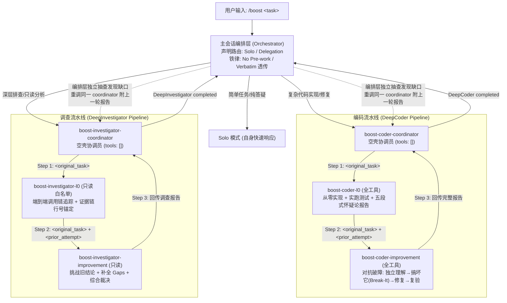

# ⚡ open-boost

> **Universal Adversarial Deep-Reasoning Multi-Agent Plugin for Coding Harnesses**
> 
> *Targeting Pi, OpenCode, and OMP with high-efficiency Flash LLMs (Gemini-3.8-Flash, DeepSeek-v4.1-Flash).*

[](https://opensource.org/licenses/Apache-2.0)
[](https://nodejs.org/)
[]()

---

## 📖 English Introduction

### The Core Thesis
**Deep reasoning comes from adversarial multi-round protocols and structured cognitive contracts, not from expensive models.**

`open-boost` open-sources and ports the `/boost` deep reasoning framework (originally inspired by Google Antigravity CLI's hidden `/boost` command and reverse-engineered / battle-tested in OMP) to mainstream open-source terminal coding harnesses:

- **Pi Coding Agent** (`pi`)
- **OpenCode** (`opencode`)
- **Oh My Pi** (`omp`)
*(Grok Build, Codex CLI, and DSH support planned)*

By enforcing strict role isolation, a 2-step adversarial pipeline (**L0 Worker from scratch** ➔ **Improvement Worker Break-It**), and honest skepticism reporting, `open-boost` enables cost-effective **Flash models** (such as `gemini-3.8-flash`, `deepseek-v4.1-flash`, `qwen-2.5-coder-32b`) to solve subtle bugs, race conditions, and complex multi-hop investigations that usually stump single-agent pipelines.

---

## 架构总览 (Architecture Overview)



---

## ⚡ 快速安装 (Quick Installation)

跨平台支持 **Linux**、**macOS**、**Windows**，纯原生 Node.js（>= 18.0.0），零外部二进制依赖。

### 方式一：一键自动安装 (Auto-detect & Install)

```bash
git clone https://github.com/open-boost/open-boost.git
cd open-boost

# 检查当前系统已安装的 coding harness 及 open-boost 状态
node install.js status

# 自动安装 open-boost 到所有检测到的 harness (Pi, OpenCode, OMP)
node install.js install
```

### 方式二：指定目标 Harness 安装

```bash
# 只安装到 Pi
node install.js install --target pi

# 只安装到 OpenCode
node install.js install --target opencode

# 同时安装到 Pi 和 OMP
node install.js install --target pi,omp
```

### 方式三：作为全局 CLI 安装使用

```bash
npm install -g .
# 或使用 npm 链接
npm link

open-boost status
open-boost install
```

---

## 🚀 使用方法 (Usage)

在您习惯的任意 CLI Harness 中，像在 Google Antigravity 中一样使用 `/boost`：

### 1. 在 Pi 中使用
```bash
pi
> /boost 修复 connection_pool.py 中的死锁问题，确保高并发压测不泄露
```
或直接在非交互模式中执行：
```bash
pi -p "/boost 修复 connection_pool.py 中的死锁问题"
```

### 2. 在 OpenCode 中使用
```bash
opencode
> /boost 深入排查为什么在 batch_size > 500 时 worker 内存线性泄漏，不修改任何代码
```
或使用注册好的 Custom Command：
```bash
opencode run "/boost trace memory leak in batch processor"
```

### 3. 在 OMP (Oh My Pi) 中使用
```bash
omp
> /boost 修复 moving_avg.py 中的滑窗浮点累积误差 bug，pytest 全绿，不许改测试
```

---

## 🛡️ 七大设计守恒量 (The 7 Boost Invariants)

1. **声明式路由 (Declarative Routing)**：编排者在采取任何行动前，必须显式声明走 `Solo` 还是 `Delegation` 模式。
2. **No Pre-work 铁律**：主会话编排层在首次委派 Coordinator 前，**零自主探索、零代码读取、零编辑**，职责严格限定为“只路由、不解题”。
3. **高保真原样传话 (Verbatim Forwarding)**：发送给 Coordinator 的 `<original_task>` 必须是用户原始输入的逐字拷贝，严禁主会话擅自篡改或加料。
4. **回传不另起 (Sticky Session / Continuity)**：编排层抽查若发现缺口，必须重新调用**同一个** Coordinator，并将上一轮完整报告作为 `<prior_attempt>` 附带，绝不推翻重来。
5. **宁多勿少 (Aggressive Continuation)**：四大条件任一满足必须追加新一轮（需求项多未完全覆盖 / 范围模糊 / 发现任何 Bug / Worker 自报存在已知缺陷）。
6. **怀疑论报告协议 (Skepticism Reporting Protocol)**：
   - 编码报告必须包含：`Skepticism Disclaimer`、`Deep/Shallow/Unverified` 三级验证、`Fatal/Shallow/Minor` 三级已知问题。
   - 改进轮必须包含：`input → expected → actual → root cause → fix` 破障实体用例，且必须核实测试用例未被篡改。
   - 调查报告必须包含：`claim → evidence → verdict` 与 `Remaining Questions & Gaps`。
7. **单次汇报 (Single Delivery)**：子 Agent 运行全程禁止碎碎念式中间状态刷屏，完成时刻唯一一次完整结构化交付，保护父级上下文。

---

## 🎯 针对 Flash 模型的四大认知防御

针对 `gemini-3.8-flash`、`deepseek-v4.1-flash` 等轻量 Flash 模型容易出现的认知缺陷，`open-boost` 施加了专门的认知防御体系：

- **防谄媚 (Anti-Sycophancy)**：Improvement Worker 必须在**不看上一轮报告**的前提下，独立写出需求理解与攻击点（Step 1），然后才进入破坏阶段（Step 2 Break-It），必须找到至少一个 flaw 才能给通过。
- **防浅验证 (Anti-Shallow-Verification)**：三级验证划分，Deep Verification 强制提供真实运行命令与 stdout 输出；强制比对测试文件哈希，防篡改测试造假。
- **物理阻断角色漂移 (Anti-Drift)**：Coordinator 物理移除所有代码修改工具（`tools: []`），从底层彻底切断协调员擅自写代码的冲动。
- **自愈解析器 (Auto-healing Parser)**：适配层内建鲁棒的自愈解析机制，自动剔除各种网关/Harness 强制包裹的 JSON 冗余结构，确保 Markdown 报告原汁原味回传。

---

## 📂 仓库目录结构 (Repository Structure)

```
open-boost/
├── install.js                     # 顶层极简免编译安装脚本
├── package.json                   # NPM 包规范配置
├── packages/
│   ├── core/                      # SSOT 核心提示词与契约规范
│   │   ├── prompts/               # 7 个核心 Prompt 原型
│   │   │   ├── orchestrator.md
│   │   │   ├── boost-coder-coordinator.md
│   │   │   ├── boost-coder-l0.md
│   │   │   ├── boost-coder-improvement.md
│   │   │   ├── boost-investigator-coordinator.md
│   │   │   ├── boost-investigator-l0.md
│   │   │   └── boost-investigator-improvement.md
│   │   └── specs/                 # 报告 Schema 规范
│   ├── compiler/                  # 跨平台转译编译器
│   │   └── src/index.js           # 自动编译至 OMP, Pi, OpenCode 格式
│   ├── adapters/                  # 各 Harness 专用适配器
│   │   ├── omp/index.js           # OMP 递归深度与文件分发
│   │   ├── pi/index.js            # Pi TypeScript 扩展与 slash command
│   │   └── opencode/index.js      # OpenCode JSONC 配置与 subagent_depth
│   └── cli/                       # CLI 探测与安装管理入口
│       ├── bin/open-boost.js
│       └── src/installer.js
├── dist/                          # 编译产物 (即拿即用)
│   ├── omp/                       # skills/ + agents/
│   ├── pi/                        # extensions/ + skills/ + agents/
│   └── opencode/                  # commands/ + skills/ + agents/
└── test/
    └── open-boost.test.js         # 自动化单元测试套件
```

---

## 🧪 运行测试 (Running Tests)

```bash
cd open-boost
npm test
# 或者:
node --test test/open-boost.test.js
```

---

## 📄 开源许可证 (License)

Apache License 2.0. Detailed terms see [LICENSE](./LICENSE).
